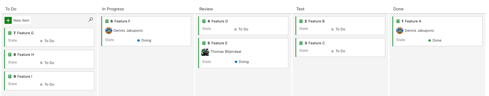

# Kanban Guidelines

## Kanban General

A kanban board helps us *visualize work*, *limit the amount of work in progress*, and *get our work done*.
The following guidelines will help us standardize our use with Kanban boards, so that we can switch projects efficiently without having to learn a new Kanban method this particular project employs.

## Board layout

We work with the following columns on the board:

1. To Do
2. In Progress
3. Review
4. Test _(Optional when the project has Quality Assurance)_
5. Done

_Figure 1 - Kanban board example with all columns and work items_

## Board rules

The team objective is to move work items on the board to the _Done_ lane as fast and best as we can. Note that this implies focus on incremental progress of the application we are building.

- You *should* only have a single work item assigned.
_Strive for focus and avoid multitasking._
- You *should* take the top work item from the To Do column when starting a new item.
_Work items in To Do *should* be prioritized in descending order (see 'PO/PL tips 'n tricks below')._
- After finishing a work item from any lane, drag it to a new lane, and change it to 'Unassigned'.
_A team member *should* follow up._
- After finishing the task of a work item in a column, look for new tasks on the board from right to left.
_Focus on getting work items to Done a.s.a.p. instead of starting items._
- You *must* assign tickets to yourself when you start working on it.
- When moving work items one or more columns back, it is *recommended* to explain your move in the comments of this item.
- After reviewing, you *must* inform the writer of the code about your findings.
_Provide the opportunity to learn, and pass on the assignment of the work item._
- You *may* create sub-items from the original work item when deemed necessary.
_Break down complex parts, or indicate remaining tasks on the work item._

## Product Owner/Leader tips 'n tricks

While developers are busy moving work items on the kanban board from left to right, the product owner is usually busy in the backlog shaping new work items, tracking progress of the board (and the current work items in progress), and looking ahead to plan upcoming work activities.

The backlog is where new work items *should* get created and can get refined with the development team. Here we check together whether we deem the work sufficiently broken into parts (or work items) so that we can honestly estimate its complexity or required time _(see Ch. 3 - Planning from the resource below)_.

The To Do column on the board *should* contain an appropriate amount of work for the development team to work on for a while. The work items in this lane *should* be organized by priority in descending order. This way, the development team *shall* start new work items with the highest value at that moment.

_For further reading on Agile development: [Clean Agile by Robert C. Martin](https://www.goodreads.com/book/show/45280021-clean-agile)._
